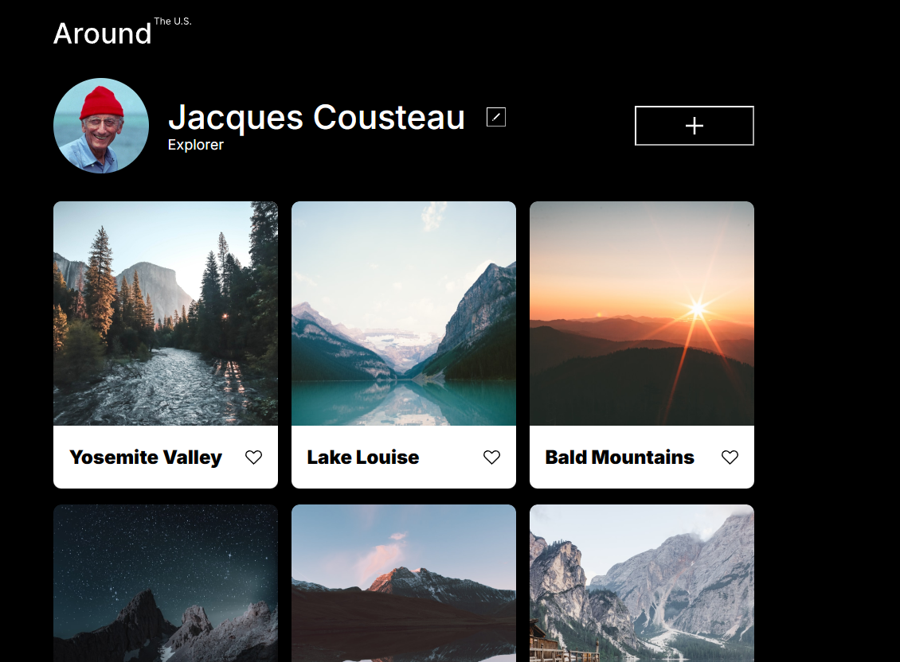

# Project 3: Around The U.S.

### Overview

- Intro
- Figma
- Images

**Intro**

This project is made so all the elements are displayed correctly on popular screen sizes. This project mainly uses grid displays to achieve this.

**Figma**

- [Link to the project on Figma](https://www.figma.com/file/ii4xxsJ0ghevUOcssTlHZv/Sprint-3%3A-Around-the-US?node-id=0%3A1)

**Images**

\*\*
Video link: https://youtu.be/IFGcVYaiJ9s

Github repo link: https://omegax117.github.io/se_project_aroundtheus/index.html

**Improvements**

Add functionality to like buttons. Add a pop up menu to add more images. Allow the edit button to change the profile picture

Better functionality on tablet displays
